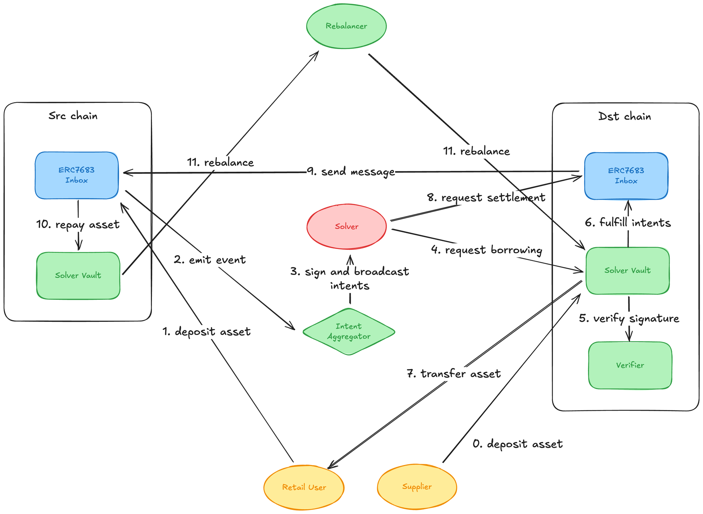

# Solver Vault
## Overview

Solver Vault is a system where DAOs, individuals, institutions, and protocols can deposit their assets—similar to the vault concept in Hyperliquid. The Solver then utilizes those assets to execute intents. Any profits generated from these vault-managed assets are distributed between the Solver and the Depositors (who provide the assets). 

Solvers do not need to have substantial capital of their own to function as Fillers, and they can potentially increase overall returns by incorporating their own strategies into the vault.
## Demo
https://solver-vault.vercel.app

## Challenges

### Solver

- **Solvers with limited capital**
    - Cannot handle large asset orders
    - Especially in cross-chain scenarios, they must wait a certain amount of time for repayment, during which they cannot accept additional orders
- **Solvers with substantial capital**
    - Struggle to access other capital opportunities
    - Low capital efficiency

### Protocol

- Relies on liquidity from a limited number of solvers, resulting in a smaller bridge cap than a typical liquidity bridge
- Only able to support a limited range of tokens
- Difficult to secure initial liquidity when developing new intent based applications

### Depositor

- For certain tokens like ETH, even with LSTs, only a few percent APY can be expected

### User

- Unable to bridge large volumes of liquidity quickly or at a low cost

## Solution

**Build a permissionless platform that allows anyone to create a Solver Vault. Solvers can then use the vault’s assets to execute intents**

### Solver

- **Solvers with limited capital**: Can now handle intents requiring large capital
- **Solvers with substantial capital**: No longer need to keep large amounts of capital locked for long periods and can leverage other capital opportunities, improving overall capital efficiency

### Protocol

- By openly collecting assets through vaults, the protocol can support larger liquidity pools and a wider variety of tokens
- Can provide initial liquidity for new intent based applications

### Depositor

- **toC**: Higher yield potential compared to existing ETH strategies (such as LST or lending)
- **toB**: Able to offer Private Vaults for DAOs or protocols, providing a higher yield solution while maintaining confidentiality

### User

- Can access faster bridging and chain abstraction with more diverse token support
- Able to bridge larger asset amounts at lower costs

## Architecture

0. **Supplier deposits assets into the Dst chain**  
   The Supplier initially deposits assets into the ERC7683 Inbox (Dst) on the Dst chain.

1. **Retail User deposits assets into the Src chain**  
   The Retail User deposits assets into the Solver Vault (Src) on the Src chain.

2. **Event emission (emit event)**  
   As a result of the deposit into the Solver Vault (Src), the ERC7683 Inbox (Src) on the Src chain emits an event.

3. **Signing and broadcasting the intent**  
   The Intent Aggregator receives the event and prepares the intent (transaction details).  
   The Solver signs the intent and broadcasts it.

4. **Solver requests borrowing**  
   Based on the broadcasted intent, the Solver requests asset borrowing from the ERC7683 Inbox (Dst) on the Dst chain.

5. **Signature verification**  
   The ERC7683 Inbox (Dst) on the Dst chain calls the Verifier to confirm the validity of the Solver’s signature.

6. **Fulfillment of intents**  
   Once the signature is verified, the ERC7683 Inbox (Dst) instructs the Solver Vault (Dst) to execute the intent, initiating any necessary asset movement.

7. **Asset transfer**  
   The Solver Vault (Dst) transfers assets to the Supplier according to the result of the executed intent.

8. **Solver requests settlement**  
   If needed, the Solver requests settlement from the ERC7683 Inbox (Dst) on the Dst chain.

9. **Solver sends a message to the Src chain**  
   The Solver sends a message to the ERC7683 Inbox (Src), triggering further actions on the Src chain.

10. **Asset repayment**  
    The ERC7683 Inbox (Src) instructs the Solver Vault (Src) to repay any borrowed assets.

11. **Rebalancing**  
    The Rebalancer performs rebalancing on both Src and Dst chains as needed, coordinating with each ERC7683 Inbox to optimize asset distribution.

## Deployed Contracts
### Endpoint
[Base Sepolia](https://sepolia.basescan.org/address/0x338BBc10938b5dda38D7b337d161008bFd74B9c5)
### ERC20Vault
[Base Sepolia](https://sepolia.basescan.org/address/0x8E09C775Aa0Bb95A1b7948A01ebfdaF108C83E9F)
### ETHVault
[Base Sepolia](https://sepolia.basescan.org/address/0x1F2EE6aB0188961465779909a2f51F286dA3cDf7)

## Future work
- Support more chains, tokens, and protocols
- Verify in advance whether the intent parameters were correct
- Add a rebalancing mechanism to optimize asset distribution (e.g. use Everclear)